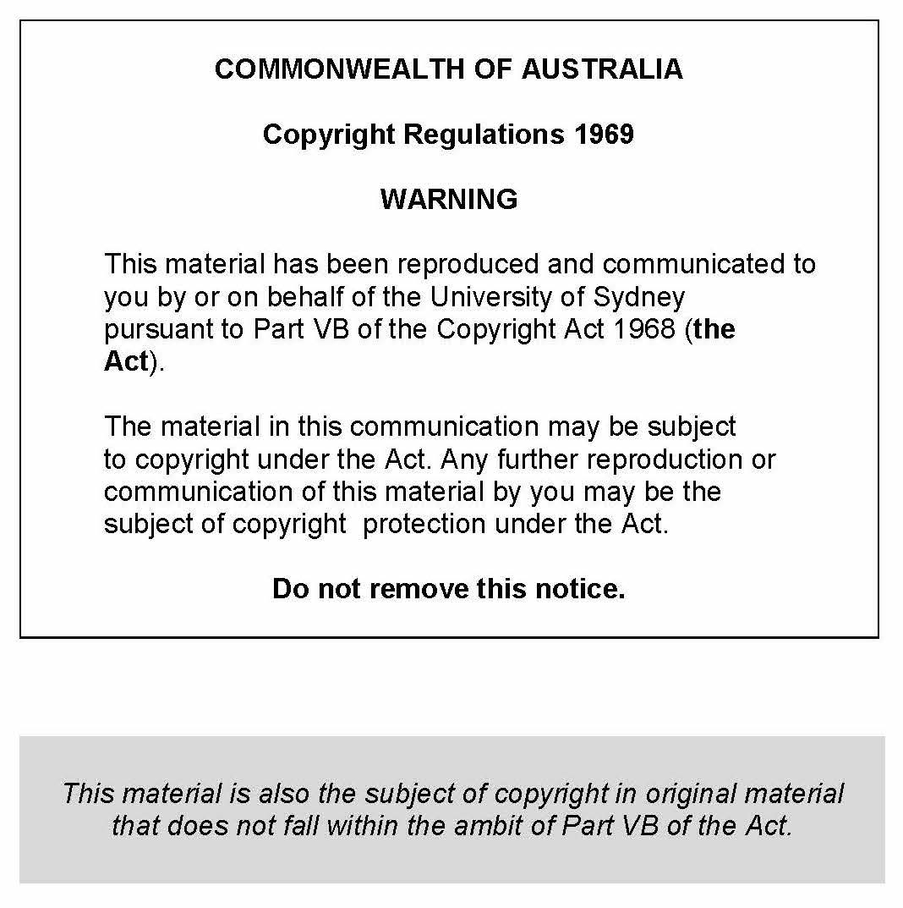

<head>
<style>

tr:hover{background-color:#f5f5f5}

</style>
</head>


```{r setup, include=FALSE}
knitr::opts_chunk$set(echo = FALSE)
```


<div align="center">

</div>

<br>


# <i class="fa fa-info-circle" aria-hidden="true"></i> Course information {.tabset .tabset-fade .tabset-pills}

## Aim

### Aim

Lorem ipsum dolor sit amet, consectetuer adipiscing elit. Aenean commodo ligula eget dolor. Aenean massa. Cum sociis natoque penatibus et magnis dis parturient montes, nascetur ridiculus mus. Donec quam felis, ultricies nec, pellentesque eu, pretium quis, sem. Nulla consequat massa quis enim. Donec pede justo, fringilla vel, aliquet nec, vulputate eget, arcu. In enim justo, rhoncus ut, imperdiet a, venenatis vitae, justo. Nullam dictum felis eu pede mollis pretium.

- Lorem ipsum dolor sit amet, consectetuer adipiscing elit. 
- Aenean commodo ligula eget dolor.

<br>

## Lecturers

### Dr Jo Blogs 
- Room: Smith Building 124
- Phone: 5555 098 765
- Consultation hour: 9am Monday

### Dr ...
- Phone: 

### Dr ...
- Phone: 

<br>

## Info

### Info

It is important that you check [LMS](http://www.google.com) regularly.


## Class times

### Lectures
- Day Time, Place
- Day Time, Place
- Day Time, Place


### Tutorials
- Day Time, Place
- Day Time, Place
- Day Time, Place
- Day Time, Place
- Day Time, Place

### Practicals

- Day Time, Place
- Day Time, Place
- Day Time, Place
- Day Time, Place
- Day Time, Place

## Assessment

### Assessment

- (5%) Quiz 1 in week 5 tutorial; 
- (5%) Quiz 2 in week 8 tutorial;
- (5%) Quiz 3 in week 11 tutorial;
- (10%) Computer reports;
- (10%) Computer examination;
- (65%) Final examination - two hours.  


### More details:
Lorem ipsum dolor sit amet, consectetuer adipiscing elit. Aenean commodo ligula eget dolor. Aenean massa. Cum sociis natoque penatibus et magnis dis parturient montes, nascetur ridiculus mus. 

### Examination: 
Lorem ipsum dolor sit amet, consectetuer adipiscing elit. Aenean commodo ligula eget dolor. Aenean massa. Cum sociis natoque penatibus et magnis dis parturient montes, nascetur ridiculus mus. 

### Quizzes:
Lorem ipsum dolor sit amet, consectetuer adipiscing elit. Aenean commodo ligula eget dolor. Aenean massa. Cum sociis natoque penatibus et magnis dis parturient montes, nascetur ridiculus mus. 


## Resources

### Resources

- Lorem ipsum dolor sit amet, consectetuer adipiscing elit. 
- Aenean commodo ligula eget dolor. 
- Aenean massa. 
- Cum sociis natoque penatibus et magnis dis parturient montes. 

### Textbook

Lorem ipsum dolor sit amet, consectetuer adipiscing elit. Aenean commodo ligula eget dolor. Aenean massa. Cum sociis natoque penatibus et magnis dis parturient montes, nascetur ridiculus mus. 


## Special consideration & arrangements

### Special consideration & arrangements

Lorem ipsum dolor sit amet, consectetuer adipiscing elit. Aenean commodo ligula eget dolor. Aenean massa. Cum sociis natoque penatibus et magnis dis parturient montes, nascetur ridiculus mus. Lorem ipsum dolor sit amet, consectetuer adipiscing elit. Aenean commodo ligula eget dolor. Aenean massa. Cum sociis natoque penatibus et magnis dis parturient montes, nascetur ridiculus mus. Lorem ipsum dolor sit amet, consectetuer adipiscing elit. Aenean commodo ligula eget dolor. Aenean massa. Cum sociis natoque penatibus et magnis dis parturient montes, nascetur ridiculus mus. 

## Help

### Help

- Lorem ipsum dolor sit amet, consectetuer adipiscing elit. Aenean commodo ligula eget dolor. Aenean massa. Cum sociis natoque penatibus et magnis dis parturient montes, nascetur ridiculus mus. 
- Lorem ipsum dolor sit amet, consectetuer adipiscing elit. Aenean commodo ligula eget dolor. Aenean massa. Cum sociis natoque penatibus et magnis dis parturient montes, nascetur ridiculus mus. 

# Announcements {.tabset .tabset-fade .tabset-pills}

## Access to edstem

Please make sure that you have access to https://edstem.org. Ed will host the course discussion board. I encourage you to use this discussion board as often as possible.


# <i class="fa fa-folder-open" aria-hidden="true"></i> Course Materials


Week | Overview                       |Lecture slides | Tutorials | Pracs
-----|--------------------------------|---------------|-----------|------------------
1    | Lorem ipsum dolor  | [L1], [L2], [L3], [report_example.Rmd](Content/report_example.Rmd)                 |  [T1]          | [LabA], [Guide], [data.csv]
2    | Lorem ipsum dolor                |               |           |
3    | Lorem ipsum dolor             |               |           |
4    | Lorem ipsum dolor             |               |           |
5    | Lorem ipsum dolor               |               |           |
6    | Lorem ipsum dolor                |               |           |
7    | Lorem ipsum dolor                |               |           |
8    | Lorem ipsum dolor                   |               |           |
9    | Lorem ipsum dolor                   |               |           |
10   | Lorem ipsum dolor                   |               |           |
11   | Lorem ipsum dolor                      |               |           |
12   | Lorem ipsum dolor                      |               |           |
13   | Lorem ipsum dolor                        |               |           |


<br>
<br>
<br>
<div align="center">

</div>